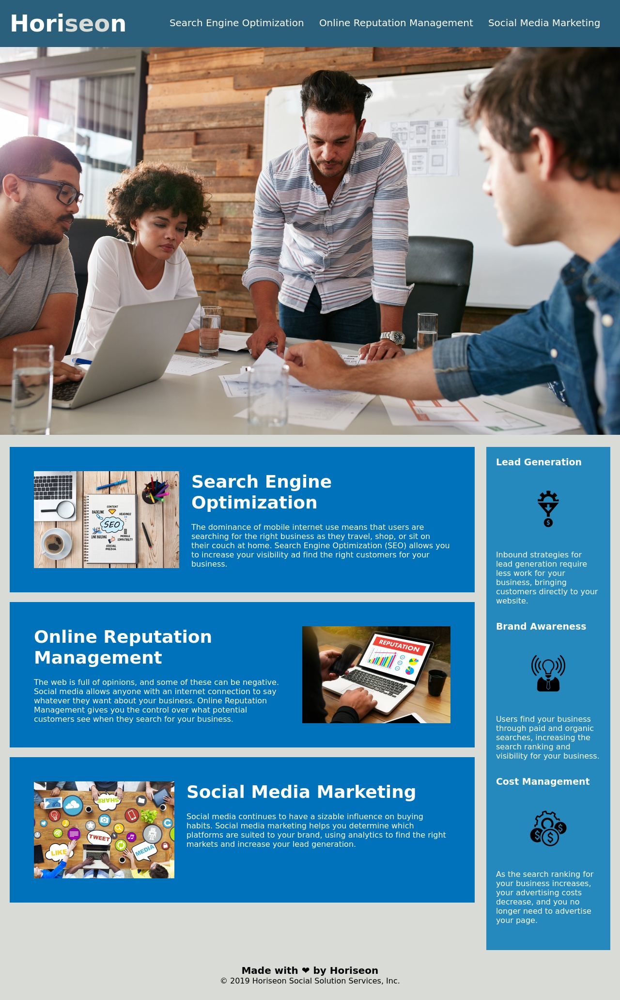

# Horiseon Web Page Update

## Update HTML
* Updated elements to semantic HTML element for better screen reading
* Update classes in HTMl with common classes between common elements
* Added ALT descriptions to all images and icons
* Added note to HTML to make it easier to read

## Updated CSS
* Update CSS to match new classes and combine CSS stlying for a more compact styling sheet
* Added notes to CSS to make it easier to read

## Link to Application
https://adamjfield.github.io/Challenge-1-Horiseon-AdamField/

## Screenshot of Application

